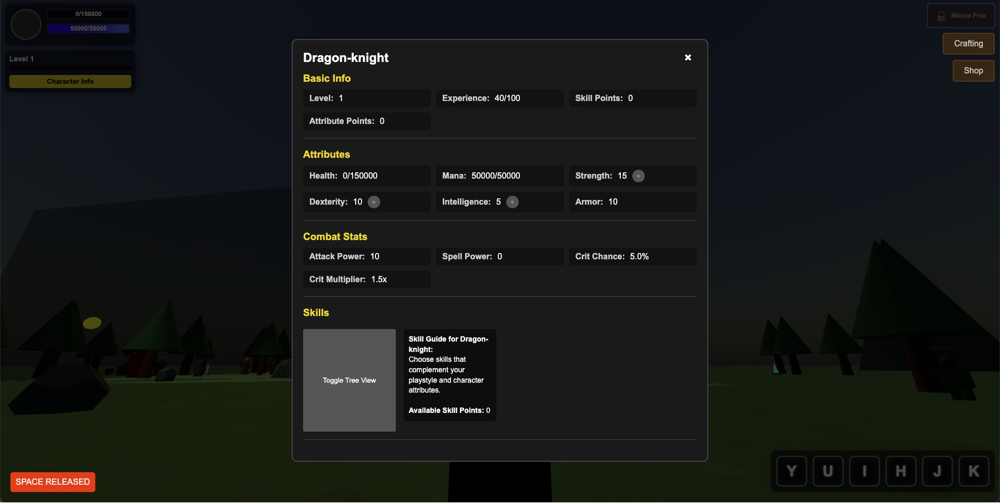

# ARPG Game

A 3D action role-playing game built with Three.js featuring multiple character classes, skills, and enemy types.

## Overview

This ARPG (Action Role-Playing Game) features a rich 3D environment where players can explore, battle enemies, collect items, and level up their characters. The game includes multiple playable hero classes, each with unique abilities and skill trees.

## Features

- **Multiple Character Classes**: Choose from Dragon Knight, Crystal Maiden, Axe, and Lina
- **Skill System**: Each class has 6 unique skills with visual effects
- **Enemy Variety**: Battle different enemy types including basic enemies, archers, mages, tanks, and bosses
- **Boss Battles**: Challenging boss encounters with special attack patterns and phases
- **Crafting System**: Collect resources and craft items
- **Shop System**: Buy and sell items
- **Experience System**: Level up your character to become more powerful
- **3D Environment**: Explore a detailed world with trees, mountains, water, and more

## Enemy System

The game features a dynamic enemy spawning system with various enemy types:

- **Basic Enemies**: Standard melee attackers
- **Archers**: Ranged attackers that keep their distance
- **Mages**: Powerful spell casters with area effects
- **Tanks**: Slow but high health enemies
- **Elite Enemies**: Stronger variants with enhanced abilities
- **Bosses**: Powerful unique enemies with special attacks

### Boss Mechanics

Bosses are the most challenging enemies in the game:

- Up to 2 bosses can be active simultaneously
- Bosses maintain a minimum distance from each other
- Each boss has multiple attack patterns:
  - **Ground Slam**: Area damage attack
  - **Fire Breath**: Directional damage over time
  - **Summon Minions**: Calls additional enemies to aid the boss
- Bosses have multiple phases that trigger at health thresholds
- Each phase increases the boss's damage and speed
- Defeating a boss grants substantial experience and may drop rare items

## Controls

### Keyboard

- **W, A, S, D**: Move character
- **Q, E**: Look left/right
- **Space**: Jump
- **Y, U, I, H, J, K**: Use skills
- **T**: Toggle auto-attack

### Mouse

- **Move Mouse**: Look around
- **Left Click**: Attack

## Getting Started

1. Clone the repository
2. Open `index.html` in your browser
3. Select your character class and begin your adventure

## System Requirements

- Modern web browser with WebGL support
- Recommended: Dedicated graphics card for optimal performance
- Keyboard and mouse

## Performance Settings

The game includes performance settings that can be adjusted in the config.js file:

- GPU Acceleration
- Low-Poly Mode
- Shadow Quality
- Effect Detail
- Particle Limits

## Development

This game is built using:

- Three.js for 3D rendering
- JavaScript ES6+
- HTML5 and CSS3

## Credits

- Sound effects and music from various free sources
- 3D models created in-house
- Textures generated using procedural techniques

## License

This project is licensed under the MIT License - see the LICENSE file for details.