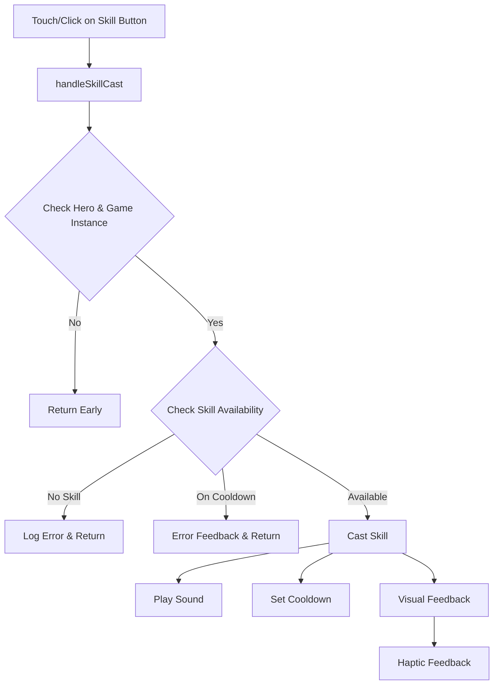

# Touch Skill Casting Implementation

## Overview
Successfully implemented touch support for skill buttons (Y, U, I, H, J, K) allowing players to cast skills by touching/clicking the skill buttons in addition to keyboard input.

## Features Implemented

### 🎮 Core Functionality
- **Touch & Click Support**: All skill buttons now respond to both touch and mouse click events
- **Skill Validation**: Checks if hero has the skill before attempting to cast
- **Cooldown Management**: Prevents casting skills that are on cooldown with user feedback
- **Sound Integration**: Plays skill sounds when casting via touch/click

### 📱 Mobile Optimizations
- **Responsive Design**: Larger skill buttons on mobile devices for better touch interaction
- **Haptic Feedback**: 
  - Vibration on successful skill cast (75ms)
  - Triple vibration pattern for errors (50ms x3)
- **Touch-Friendly Styling**:
  - `touch-action: manipulation` for better responsiveness
  - `user-select: none` to prevent text selection
  - Larger touch targets on smaller screens

### 🎨 Visual Feedback
- **Button Press Animation**: 3D transform effects on touch/click
- **Pressed State**: Visual indication during interaction
- **Hover Effects**: Enhanced for both mouse and touch
- **Glow Effects**: Animated glow on interaction

## Technical Implementation

### Files Modified

#### 1. `js/ui/hud.js`
- **Constructor**: Added `gameInstance` parameter to receive reference to main game
- **Skill Bar Creation**: Enhanced with touch event handlers
- **Touch Events**:
  ```javascript
  slot.addEventListener('touchstart', handleTouchStart, { passive: false });
  slot.addEventListener('touchend', handleTouchEnd, { passive: false });
  slot.addEventListener('click', handleSkillCast);
  ```
- **Visual Feedback**: Added pressed state management and haptic feedback
- **Responsive CSS**: Enhanced mobile-first design for touch interaction

#### 2. `js/main.js`
- **HUD Initialization**: Pass game instance to HUD constructor
- **Hero Reference**: Update HUD with hero reference after creation
- **castSkill Method**: New method to handle skill casting from UI
- **Validation Logic**: Cooldown and skill availability checks

#### 3. `css/style.css`
- **Mouse Capture Toggle**: Hidden for mobile optimization
- **Touch Controls**: Better integration with existing UI

### Code Structure



## Responsive Design Breakpoints

### Desktop (Default)
- Skill Button Size: 70x70px
- Gap: 15px

### Tablet (≤1024px)
- Skill Button Size: 80x80px
- Gap: 12px

### Mobile (≤768px)
- Skill Button Size: 85x85px
- Gap: 15px

### Small Mobile (≤480px)
- Skill Button Size: 75x75px
- Gap: 12px
- Flex wrap for better layout

## User Experience Enhancements

### Touch Interaction Flow
1. **Touch Start**: Visual pressed state applied
2. **Touch Move**: Maintains state if touch stays within button
3. **Touch End**: 
   - Removes pressed state
   - Checks if touch ended within button bounds
   - Triggers skill cast if valid

### Error Handling
- **No Skill Available**: Console log with skill key
- **Skill on Cooldown**: Console log with remaining time
- **Haptic Differentiation**: Different vibration patterns for success vs error

### Accessibility
- **Context Menu**: Disabled on long press to prevent conflicts
- **Touch Action**: Optimized for gaming interaction
- **Visual Clarity**: Clear button states and feedback

## Testing Checklist

- [ ] Touch skill casting works on mobile devices
- [ ] Click skill casting works on desktop
- [ ] Cooldown prevention functions correctly
- [ ] Haptic feedback works on supported devices
- [ ] Visual animations play smoothly
- [ ] Sound effects trigger on skill cast
- [ ] Responsive design adapts to different screen sizes
- [ ] No conflicts with existing keyboard controls

## Browser Compatibility

### Touch Events
- ✅ iOS Safari 10+
- ✅ Android Chrome 60+
- ✅ Mobile Firefox 55+

### Haptic Feedback
- ✅ Android Chrome 55+
- ✅ Mobile Firefox 79+
- ❌ iOS Safari (vibration API not supported)

### Visual Effects
- ✅ All modern browsers with CSS3 support
- ✅ Hardware acceleration for smooth animations

## Performance Considerations

- **Event Listeners**: Passive flags used where appropriate
- **Animation**: CSS transforms for hardware acceleration
- **Memory**: Event handlers properly bound to avoid memory leaks
- **Touch Responsiveness**: Immediate visual feedback prevents perceived lag

## Future Enhancements

### Potential Improvements
1. **Gesture Support**: Swipe gestures for skill combinations
2. **Custom Haptic Patterns**: Unique vibrations per skill type
3. **Visual Effects**: Particle effects on button press
4. **Sound Customization**: Different button press sounds per skill
5. **Multi-touch**: Support for casting multiple skills simultaneously

### Integration Points
- **Skill Tree UI**: Touch navigation improvements
- **Inventory System**: Consistent touch interaction patterns
- **Settings Menu**: Touch-friendly configuration options

## Conclusion

The touch skill casting implementation successfully bridges the gap between traditional keyboard controls and modern touch interfaces. Players can now enjoy the game on both desktop and mobile devices with intuitive touch controls that feel native to each platform.

The implementation maintains backward compatibility with existing keyboard controls while adding a layer of accessibility and modern user experience expectations for touch devices.